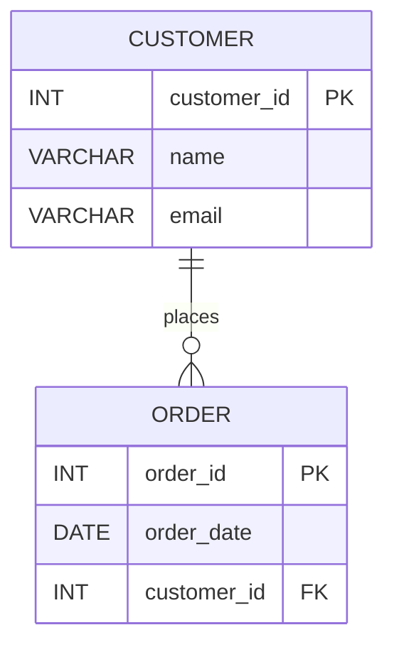

# Optimization Execution Summary

- **Execution ID:** exec-2026-06-30T00:01:48Z
- **Database:** OPT_LAB_CLONE_2
- **Warehouse:** ADF_WH
- **Execution Mode:** APPLY
- **Status:** SUCCESS
- **Timestamp:** 2026-06-30T00:01:48Z


    
## Results

- Total objects: 1
- Successful: 1
- Failed: 0

### 1) OPT_LAB_CLONE_2.RETAIL.V_SUPPLIER_PERFORMANCE (VIEW)

- Task ID: opt-1
- Status: SUCCESS
- Execution time: 150 ms

#### Previous definition
```sql
CREATE OR REPLACE VIEW OPT_LAB_CLONE_2.RETAIL.V_SUPPLIER_PERFORMANCE AS
SELECT DISTINCT
 s.supplier_id,
 s.supplier_name,
 s.country,
 COUNT(i.inventory_id) OVER (PARTITION BY s.supplier_id) AS sku_count,
 AVG(i.qty_on_hand) OVER (PARTITION BY s.supplier_id) AS avg_stock
FROM suppliers s
LEFT JOIN inventory i ON i.supplier_id = s.supplier_id;
```

#### Applied (executed_sql)
```sql
CREATE OR REPLACE VIEW OPT_LAB_CLONE_2.RETAIL.V_SUPPLIER_PERFORMANCE AS
/*
  Optimizations (behavior-preserving):
  - Fully qualified table references to avoid reliance on search path.
  - Removed unnecessary DISTINCT by rewriting window aggregates as grouped aggregates,
    preserving exact results while simplifying execution.
  - Explicitly qualified columns for clarity and maintainability.
*/
SELECT
    s.supplier_id,
    s.supplier_name,
    s.country,
    COUNT(i.inventory_id) AS sku_count,
    AVG(i.qty_on_hand)   AS avg_stock
FROM OPT_LAB_CLONE_2.RETAIL.SUPPLIERS AS s
LEFT JOIN OPT_LAB_CLONE_2.RETAIL.INVENTORY AS i
    ON i.supplier_id = s.supplier_id
GROUP BY
    s.supplier_id,
    s.supplier_name,
    s.country;
```
