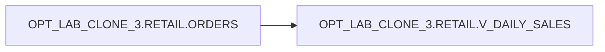

# Lineage — OPT_LAB_CLONE_3.RETAIL.V_DAILY_SALES

## Sources
- `OPT_LAB_CLONE_3.RETAIL.ORDERS`

## Transformations
1. Aggregate `ORDERS` by `ORDER_DATE` to compute `DAILY_TOTAL`.
2. Compute `RUNNING_TOTAL` as a cumulative sum of `DAILY_TOTAL` ordered by `ORDER_DATE`.

## Diagram (Mermaid)

