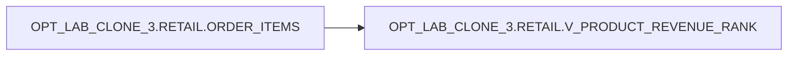

# Lineage — OPT_LAB_CLONE_3.RETAIL.V_PRODUCT_REVENUE_RANK

## Object lineage
- **View:** `OPT_LAB_CLONE_3.RETAIL.V_PRODUCT_REVENUE_RANK`
  - **Reads from:** `OPT_LAB_CLONE_3.RETAIL.ORDER_ITEMS`

## Mermaid

