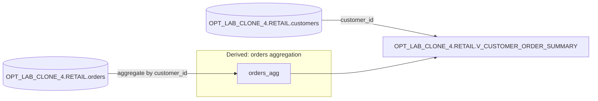

# Object Lineage

## Summary
`OPT_LAB_CLONE_4.RETAIL.V_CUSTOMER_ORDER_SUMMARY` reads from `customers` and a single aggregated pass over `orders`, joined by `customer_id`.

```mermaid
flowchart LR
  C[(OPT_LAB_CLONE_4.RETAIL.customers)] -->|customer_id| V[OPT_LAB_CLONE_4.RETAIL.V_CUSTOMER_ORDER_SUMMARY]
  O[(OPT_LAB_CLONE_4.RETAIL.orders)] -->|aggregate by customer_id| A[orders_agg]
  A --> V

  subgraph orders_agg [Derived: orders aggregation]
    A
  end
```
