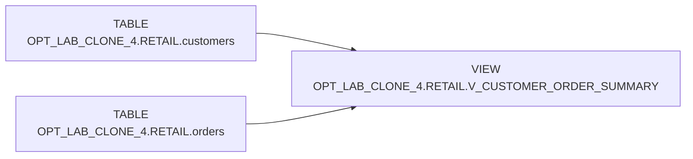

# Lineage: OPT_LAB_CLONE_4.RETAIL.V_CUSTOMER_ORDER_SUMMARY

## Notes
- The view reads all customers and left-joins a single aggregated subquery over orders.
- Aggregation is performed once per `customer_id` in `orders`.
