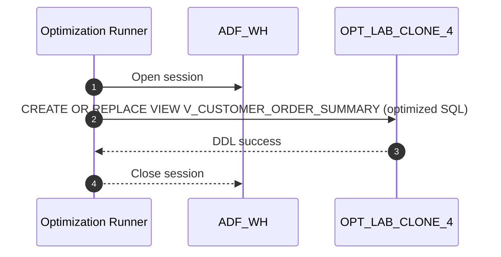

# Procedure flow — exec-2026-07-17T02:15:00Z

## Execution context
- **Warehouse**: `ADF_WH`
- **Mode**: `APPLY`
- **Object**: `OPT_LAB_CLONE_4.RETAIL.V_CUSTOMER_ORDER_SUMMARY` (`VIEW`)
- **Task ID**: `opt-1`

## Flow


## Applied SQL
```sql
CREATE OR REPLACE VIEW OPT_LAB_CLONE_4.RETAIL.V_CUSTOMER_ORDER_SUMMARY AS
SELECT
 c.customer_id, -- Explicit customer identifier
 COALESCE(o_agg.num_orders, 0) AS num_orders,
 COALESCE(o_agg.total_spent, 0) AS total_spent, -- Default 0 when no orders
 o_agg.last_order -- NULL when no orders (kept for semantic clarity)
FROM OPT_LAB_CLONE_4.RETAIL.customers AS c
LEFT JOIN (
 -- Single aggregation over orders instead of three correlated subqueries
 SELECT
 o.customer_id,
 COUNT() AS num_orders, -- Explicit COUNT() for per-customer order count
 SUM(o.order_total) AS total_spent, -- Total amount spent per customer
 MAX(o.order_date) AS last_order -- Most recent order date per customer
 FROM OPT_LAB_CLONE_4.RETAIL.orders AS o
 GROUP BY o.customer_id -- One grouped pass over orders
) AS o_agg
 ON o_agg.customer_id = c.customer_id;
```
