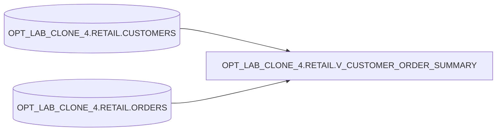

## Notes

- Previous definition joins `CUSTOMERS` to an aggregated derived table over `ORDERS`.
- Optimized (attempted) definition joins `CUSTOMERS` to `ORDERS` directly and aggregates with `GROUP BY`. APPLY failed due to invalid column reference.