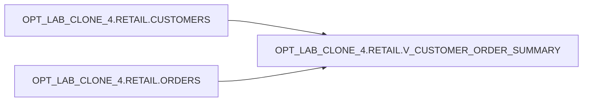

# Lineage (object-level)

## Upstream → Downstream

- `OPT_LAB_CLONE_4.RETAIL.CUSTOMERS` → `OPT_LAB_CLONE_4.RETAIL.V_CUSTOMER_ORDER_SUMMARY`
- `OPT_LAB_CLONE_4.RETAIL.ORDERS` → `OPT_LAB_CLONE_4.RETAIL.V_CUSTOMER_ORDER_SUMMARY`

## Diagram (Mermaid)

