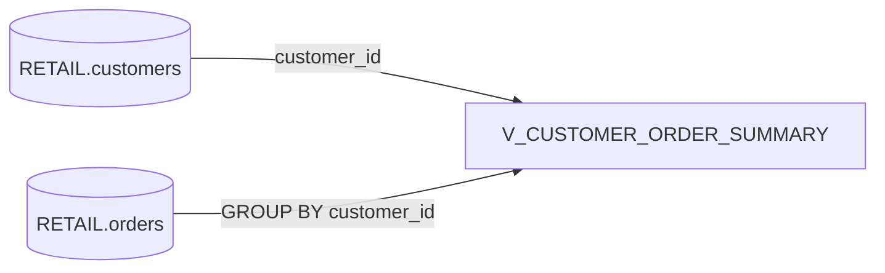

# Lineage (Object-level) — V_CUSTOMER_ORDER_SUMMARY

- **Target:** `OPT_LAB_CLONE_4.RETAIL.V_CUSTOMER_ORDER_SUMMARY`
- **Sources:**
  - `OPT_LAB_CLONE_4.RETAIL.customers` (base rows)
  - `OPT_LAB_CLONE_4.RETAIL.orders` (aggregated per `customer_id`)

## Relationship
- `customers` **LEFT JOIN** aggregated `orders` on `customer_id`.

