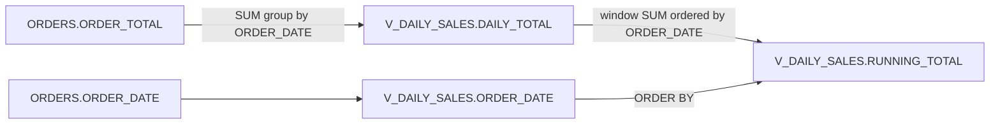

# Column Lineage — OPT_LAB_CLONE_4.RETAIL.V_DAILY_SALES

- **Object:** OPT_LAB_CLONE_4.RETAIL.V_DAILY_SALES (VIEW)
- **Execution ID:** exec-2026-07-12T04:00:00Z

## Column Mappings

| Target Column | Upstream Column(s) | Transformation |
|---|---|---|
| `ORDER_DATE` | `OPT_LAB_CLONE_4.RETAIL.ORDERS.ORDER_DATE` | passthrough (group key) |
| `DAILY_TOTAL` | `OPT_LAB_CLONE_4.RETAIL.ORDERS.ORDER_TOTAL` | `SUM(ORDER_TOTAL)` grouped by `ORDER_DATE` |
| `RUNNING_TOTAL` | `DAILY_TOTAL` (derived) | `SUM(DAILY_TOTAL) OVER (ORDER BY ORDER_DATE ROWS BETWEEN UNBOUNDED PRECEDING AND CURRENT ROW)` |

## Diagram

