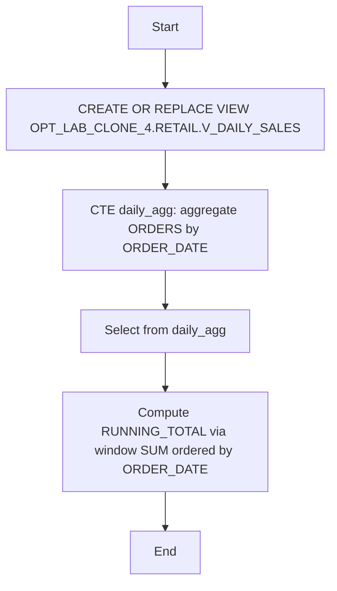

# Procedure Flow — OPT_LAB_CLONE_4.RETAIL.V_DAILY_SALES

- **Object:** OPT_LAB_CLONE_4.RETAIL.V_DAILY_SALES (VIEW)
- **Execution ID:** exec-2026-07-12T04:00:00Z

This optimization is a single DDL operation (no stored procedure).

## Flow



## Before (Previous Definition)

```sql
create or replace view V_DAILY_SALES(
	ORDER_DATE,
	DAILY_TOTAL,
	RUNNING_TOTAL
) as
SELECT
    o.order_date,
    SUM(o.order_total) AS daily_total,
    -- Use the daily_total aggregate in the window function instead of re-aggregating
    SUM(SUM(o.order_total)) OVER (
        ORDER BY o.order_date
        ROWS BETWEEN UNBOUNDED PRECEDING AND CURRENT ROW
    ) AS running_total
FROM OPT_LAB_CLONE_4.RETAIL.orders AS o
GROUP BY
    o.order_date;
```

## After (Applied Definition)

```sql
CREATE OR REPLACE VIEW OPT_LAB_CLONE_4.RETAIL.V_DAILY_SALES AS
/*
  Optimizations:
  - Use a derived table to perform the aggregation once, then apply the
    window function on the aggregated result set. This avoids redundant
    SUM(SUM(...)) and makes the intent clearer to the optimizer.
  - Keep ordering of the running total explicit on order_date.
*/
WITH daily_agg AS (
    SELECT
        o.order_date,
        SUM(o.order_total) AS daily_total
    FROM OPT_LAB_CLONE_4.RETAIL.orders AS o
    GROUP BY
        o.order_date
)
SELECT
    order_date,
    daily_total,
    SUM(daily_total) OVER (
        ORDER BY order_date
        ROWS BETWEEN UNBOUNDED PRECEDING AND CURRENT ROW
    ) AS running_total
FROM daily_agg;
```
