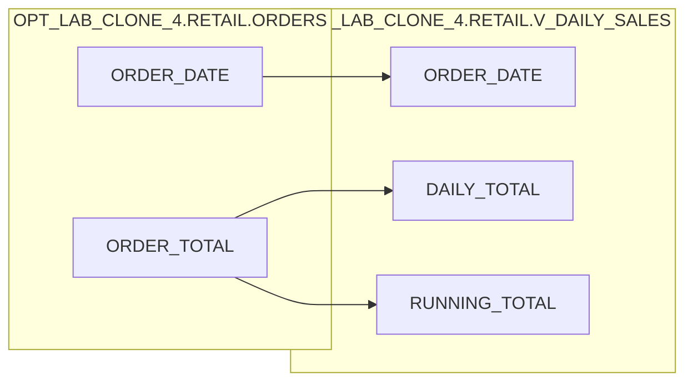

# Column Lineage

- **Target**: `OPT_LAB_CLONE_4.RETAIL.V_DAILY_SALES`

## Column Mapping

| Target Column | Source Column(s) | Derivation |
|---|---|---|
| `ORDER_DATE` | `OPT_LAB_CLONE_4.RETAIL.ORDERS.ORDER_DATE` | Direct passthrough (`o.order_date`) |
| `DAILY_TOTAL` | `OPT_LAB_CLONE_4.RETAIL.ORDERS.ORDER_TOTAL` | `SUM(o.order_total)` grouped by `o.order_date` |
| `RUNNING_TOTAL` | `OPT_LAB_CLONE_4.RETAIL.ORDERS.ORDER_TOTAL` | `SUM(SUM(o.order_total)) OVER (ORDER BY o.order_date)` (running cumulative sum of daily totals) |

