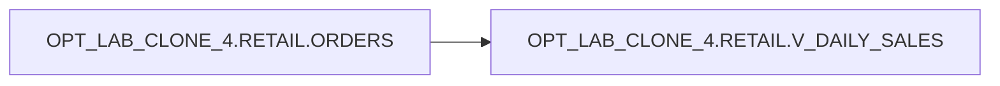

# Lineage

- **Target**: `OPT_LAB_CLONE_4.RETAIL.V_DAILY_SALES`
- **Type**: `VIEW`

## High-level Lineage

`OPT_LAB_CLONE_4.RETAIL.ORDERS` → `OPT_LAB_CLONE_4.RETAIL.V_DAILY_SALES`

## Transformation Summary

- Groups `ORDERS` by `order_date`.
- Computes `daily_total` as `SUM(order_total)` per date.
- Computes `running_total` as a running cumulative total of daily totals ordered by `order_date`.
