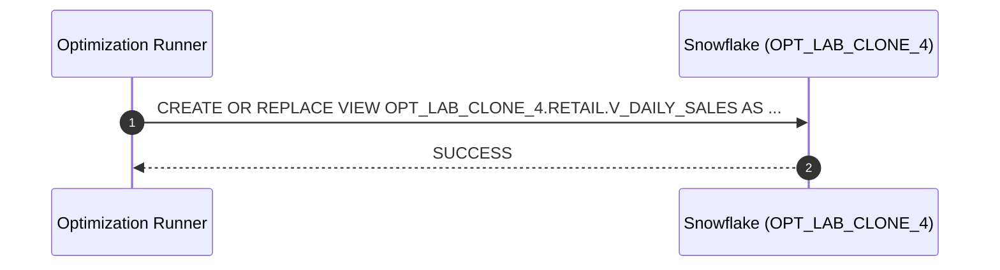

# Procedure Flow

## Execution

- **Execution ID**: `exec-2026-07-12T08:15:00Z`
- **Warehouse**: `ADF_WH`
- **Mode**: `APPLY`
- **Object**: `OPT_LAB_CLONE_4.RETAIL.V_DAILY_SALES` (`VIEW`)
- **Status**: `SUCCESS`

## Flow



## SQL Applied

```sql
CREATE OR REPLACE VIEW OPT_LAB_CLONE_4.RETAIL.V_DAILY_SALES AS
SELECT
    o.order_date,
    /* Daily total sales per order_date */
    SUM(o.order_total)                                         AS daily_total,
    /* Running cumulative total of daily sales over time */
    SUM(SUM(o.order_total)) OVER (
        ORDER BY o.order_date
    ) AS running_total
FROM OPT_LAB_CLONE_4.RETAIL.orders AS o
GROUP BY
    o.order_date;
```
