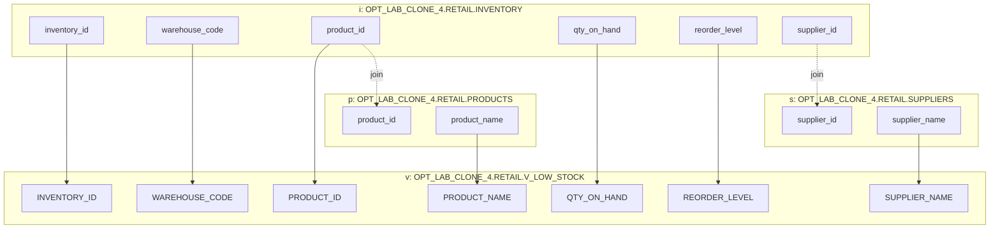

# Column lineage

Target: `OPT_LAB_CLONE_4.RETAIL.V_LOW_STOCK`

| Target column | Source relation | Source column / expression | Transformation |
|---|---|---|---|
| `INVENTORY_ID` | `OPT_LAB_CLONE_4.RETAIL.INVENTORY i` | `i.inventory_id` | direct |
| `WAREHOUSE_CODE` | `OPT_LAB_CLONE_4.RETAIL.INVENTORY i` | `i.warehouse_code` | direct |
| `PRODUCT_ID` | `OPT_LAB_CLONE_4.RETAIL.INVENTORY i` | `i.product_id` | direct |
| `QTY_ON_HAND` | `OPT_LAB_CLONE_4.RETAIL.INVENTORY i` | `i.qty_on_hand` | direct |
| `REORDER_LEVEL` | `OPT_LAB_CLONE_4.RETAIL.INVENTORY i` | `i.reorder_level` | direct |
| `PRODUCT_NAME` | `OPT_LAB_CLONE_4.RETAIL.PRODUCTS p` | `p.product_name` | joined via `p.product_id = i.product_id` |
| `SUPPLIER_NAME` | `OPT_LAB_CLONE_4.RETAIL.SUPPLIERS s` | `s.supplier_name` | joined via `s.supplier_id = i.supplier_id` |

