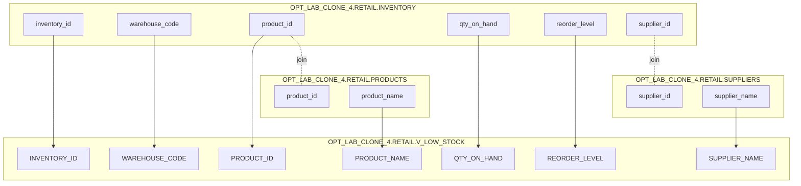

# Column Lineage — OPT_LAB_CLONE_4.RETAIL.V_LOW_STOCK

## Column mapping

| View column | Expression | Upstream column(s) |
|---|---|---|
| INVENTORY_ID | `i.inventory_id` | `OPT_LAB_CLONE_4.RETAIL.INVENTORY.inventory_id` |
| WAREHOUSE_CODE | `i.warehouse_code` | `OPT_LAB_CLONE_4.RETAIL.INVENTORY.warehouse_code` |
| PRODUCT_ID | `i.product_id` | `OPT_LAB_CLONE_4.RETAIL.INVENTORY.product_id` |
| QTY_ON_HAND | `i.qty_on_hand` | `OPT_LAB_CLONE_4.RETAIL.INVENTORY.qty_on_hand` |
| REORDER_LEVEL | `i.reorder_level` | `OPT_LAB_CLONE_4.RETAIL.INVENTORY.reorder_level` |
| PRODUCT_NAME | `p.product_name` | `OPT_LAB_CLONE_4.RETAIL.PRODUCTS.product_name` |
| SUPPLIER_NAME | `s.supplier_name` | `OPT_LAB_CLONE_4.RETAIL.SUPPLIERS.supplier_name` |

## Mermaid (column-level lineage)

