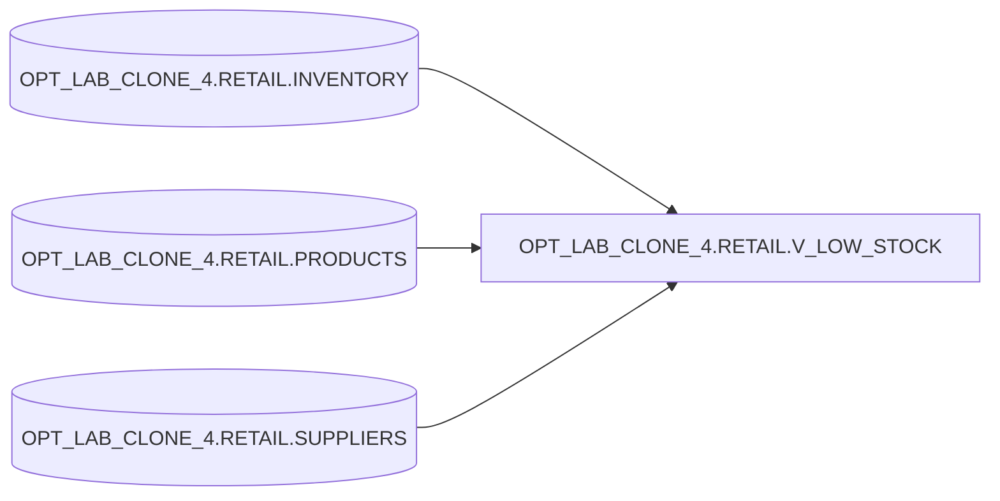

# Lineage

## High-level lineage
`OPT_LAB_CLONE_4.RETAIL.V_LOW_STOCK` derives from:
- `OPT_LAB_CLONE_4.RETAIL.INVENTORY`
- `OPT_LAB_CLONE_4.RETAIL.PRODUCTS`
- `OPT_LAB_CLONE_4.RETAIL.SUPPLIERS`

## Notes
- The optimized view replaces scalar subqueries with explicit `LEFT JOIN`s.
- Filter preserved: `qty_on_hand < reorder_level`.
