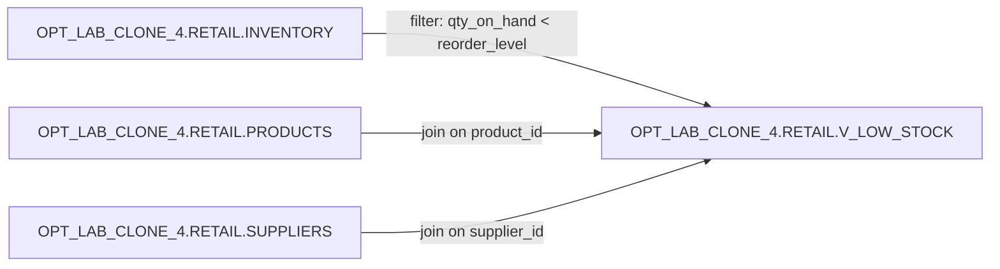

# Lineage — OPT_LAB_CLONE_4.RETAIL.V_LOW_STOCK

## Summary

`OPT_LAB_CLONE_4.RETAIL.V_LOW_STOCK` identifies low-stock inventory rows (`qty_on_hand < reorder_level`) and enriches them with product and supplier names.

## Upstream objects

- `OPT_LAB_CLONE_4.RETAIL.INVENTORY` (alias `i`)
- `OPT_LAB_CLONE_4.RETAIL.PRODUCTS` (alias `p`) — joined on `p.product_id = i.product_id`
- `OPT_LAB_CLONE_4.RETAIL.SUPPLIERS` (alias `s`) — joined on `s.supplier_id = i.supplier_id`

## Downstream objects

- None captured in this execution.

## Transformation notes

- Filter predicate: `i.qty_on_hand < i.reorder_level`
- Enrichment via `LEFT JOIN` to `PRODUCTS` and `SUPPLIERS`

## Mermaid (object-level lineage)

