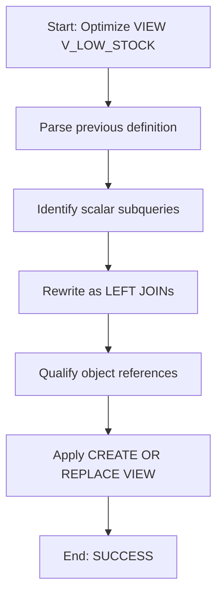

# Procedure Flow — OPT_LAB_CLONE_4.RETAIL.V_LOW_STOCK

This execution optimized and applied a replacement definition for the view.

## Steps

1. Read previous view definition containing two scalar subqueries for product and supplier names.
2. Rewrite view to use `LEFT JOIN` to `PRODUCTS` and `SUPPLIERS`.
3. Fully qualify object names.
4. Apply `CREATE OR REPLACE VIEW OPT_LAB_CLONE_4.RETAIL.V_LOW_STOCK AS ...`.

## Mermaid (flow)

