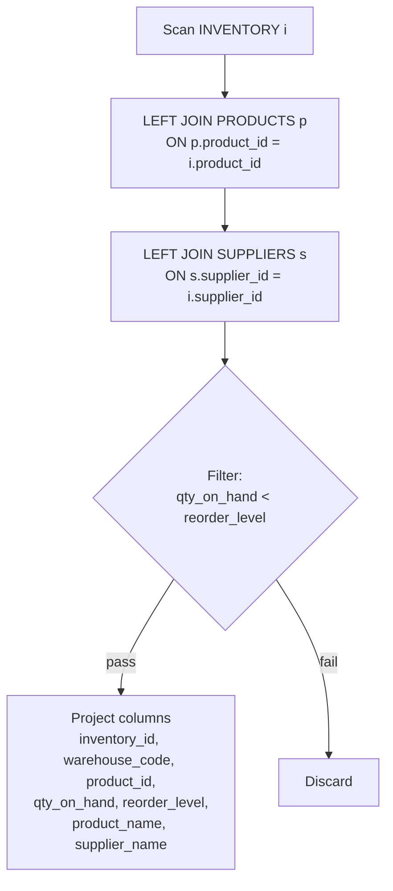

# Procedure / query flow

Object: `OPT_LAB_CLONE_4.RETAIL.V_LOW_STOCK` (VIEW)

## Logical flow
1. Read rows from `OPT_LAB_CLONE_4.RETAIL.INVENTORY` (`i`).
2. `LEFT JOIN` `OPT_LAB_CLONE_4.RETAIL.PRODUCTS` (`p`) on `p.product_id = i.product_id`.
3. `LEFT JOIN` `OPT_LAB_CLONE_4.RETAIL.SUPPLIERS` (`s`) on `s.supplier_id = i.supplier_id`.
4. Filter rows where `i.qty_on_hand < i.reorder_level`.
5. Project output columns.

## Optimization summary
- Scalar subqueries for `product_name` and `supplier_name` were replaced with joins to avoid per-row subquery evaluation.
