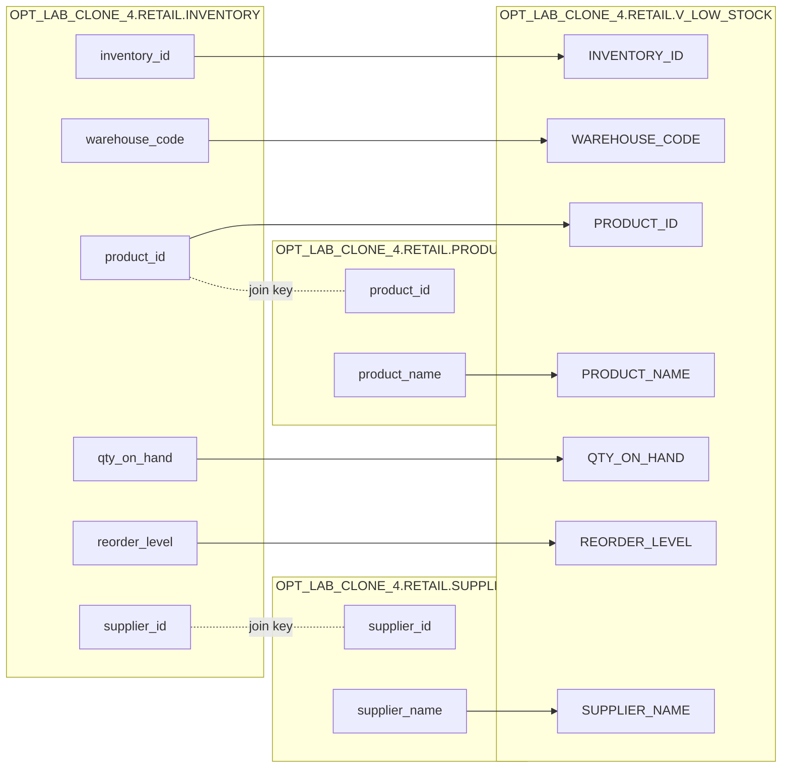

# Column Lineage: OPT_LAB_CLONE_4.RETAIL.V_LOW_STOCK (VIEW)

## Mapping (Deterministic Order)

| Target Column   | Source Column / Expression                         | Source Relation |
|----------------|-----------------------------------------------------|----------------|
| INVENTORY_ID   | i.inventory_id                                      | OPT_LAB_CLONE_4.RETAIL.INVENTORY |
| WAREHOUSE_CODE | i.warehouse_code                                    | OPT_LAB_CLONE_4.RETAIL.INVENTORY |
| PRODUCT_ID     | i.product_id                                        | OPT_LAB_CLONE_4.RETAIL.INVENTORY |
| QTY_ON_HAND    | i.qty_on_hand                                       | OPT_LAB_CLONE_4.RETAIL.INVENTORY |
| REORDER_LEVEL  | i.reorder_level                                     | OPT_LAB_CLONE_4.RETAIL.INVENTORY |
| PRODUCT_NAME   | p.product_name                                      | OPT_LAB_CLONE_4.RETAIL.PRODUCTS |
| SUPPLIER_NAME  | s.supplier_name                                     | OPT_LAB_CLONE_4.RETAIL.SUPPLIERS |

## Mermaid (Column-Level Lineage)

