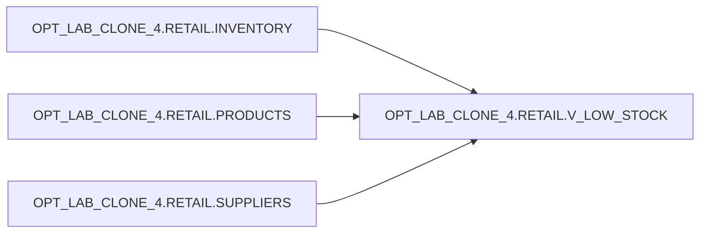

# Lineage: OPT_LAB_CLONE_4.RETAIL.V_LOW_STOCK (VIEW)

## Upstream Dependencies (Deterministic Order)

1. OPT_LAB_CLONE_4.RETAIL.INVENTORY
2. OPT_LAB_CLONE_4.RETAIL.PRODUCTS
3. OPT_LAB_CLONE_4.RETAIL.SUPPLIERS

## Downstream

- Not enumerated in this execution.

## Relationship Notes

- INVENTORY is the driving table.
- PRODUCTS and SUPPLIERS are optional lookups (LEFT JOIN) to enrich inventory rows.
- Filter retains only low-stock rows (qty_on_hand < reorder_level).

## Mermaid (Object Lineage)

