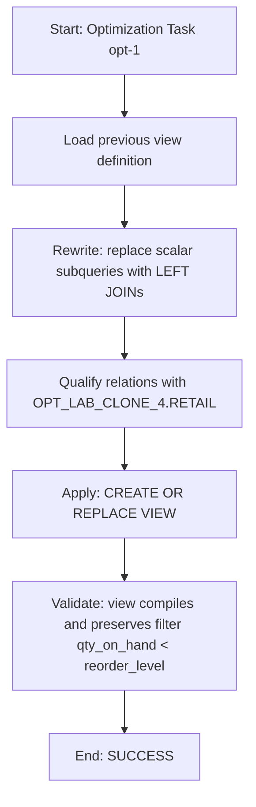

# Procedure Flow: OPT_LAB_CLONE_4.RETAIL.V_LOW_STOCK (VIEW)

## Execution Metadata

- Execution ID: exec-2026-07-12T04:15:00Z
- Warehouse: ADF_WH
- Execution Mode: APPLY
- Status: SUCCESS

## Flow Description

This optimization rewrites the view definition to replace scalar subqueries with LEFT JOINs.

## Mermaid (Flow)

## Task Result

- Task ID: opt-1
- Object: OPT_LAB_CLONE_4.RETAIL.V_LOW_STOCK
- Message: Optimized VIEW applied successfully. OPT_LAB_CLONE_4.RETAIL.V_LOW_STOCK now uses LEFT JOINs to PRODUCTS and SUPPLIERS with fully qualified references, eliminating scalar subqueries and preserving the low-stock filter.
