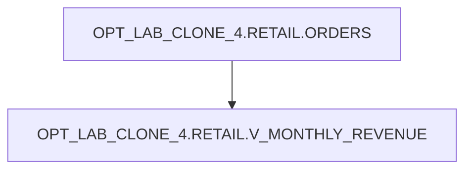

# Lineage — OPT_LAB_CLONE_4.RETAIL.V_MONTHLY_REVENUE

## Object Lineage

## Notes

- The view reads from `OPT_LAB_CLONE_4.RETAIL.ORDERS` and aggregates by truncated month.
- Filter applied: `status IN ('PAID', 'SHIPPED')`.
