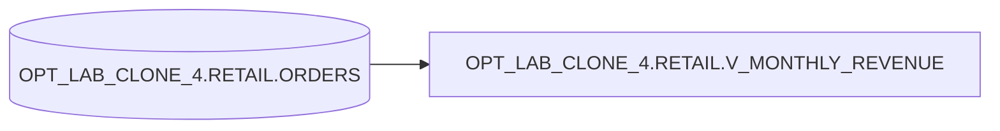

# Lineage: OPT_LAB_CLONE_4.RETAIL.V_MONTHLY_REVENUE

## Object-level lineage

## Query summary

- Grain: month (`DATE_TRUNC('month', order_date)`)
- Filter: `status IN ('PAID','SHIPPED')`
- Aggregations:
  - `COUNT(DISTINCT order_id)` as `order_count`
  - `SUM(order_total)` as `revenue`
