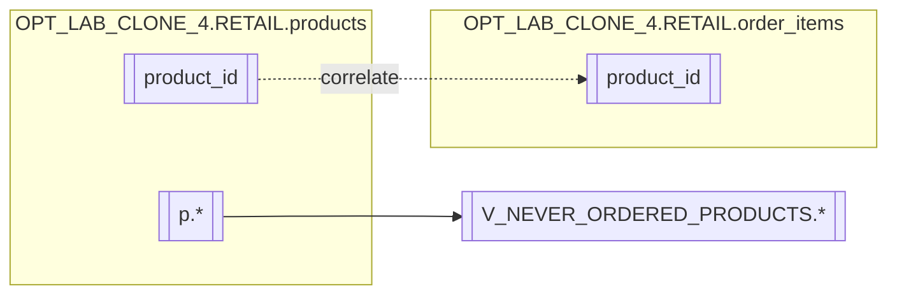

# Column Lineage — OPT_LAB_CLONE_4.RETAIL.V_NEVER_ORDERED_PRODUCTS

## Summary
The view projects `p.*`, meaning every output column is directly sourced from the corresponding column in `OPT_LAB_CLONE_4.RETAIL.products`.

## Column mapping
- Output: `*` (all columns)
  - Source: `OPT_LAB_CLONE_4.RETAIL.products.*`

## Predicate column usage
- `OPT_LAB_CLONE_4.RETAIL.products.product_id`
  - Used to correlate to `OPT_LAB_CLONE_4.RETAIL.order_items.product_id`
- `OPT_LAB_CLONE_4.RETAIL.order_items.product_id`
  - Used only in filter (NOT EXISTS)

## Diagram

