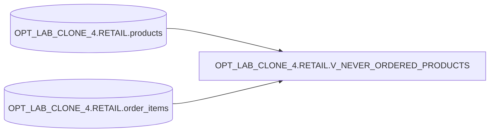

# Lineage — OPT_LAB_CLONE_4.RETAIL.V_NEVER_ORDERED_PRODUCTS

## Overview
This view returns products that have never been ordered. It selects all columns from `products` and filters out any product having matching rows in `order_items`.

## Object-level lineage

## Logic
- Source rows: `products p`
- Filter: `NOT EXISTS (SELECT 1 FROM order_items oi WHERE oi.product_id = p.product_id)`

## Execution
- execution_id: `exec-2026-07-12T09:00:00Z`
- mode: `APPLY`
- status: `SUCCESS`
