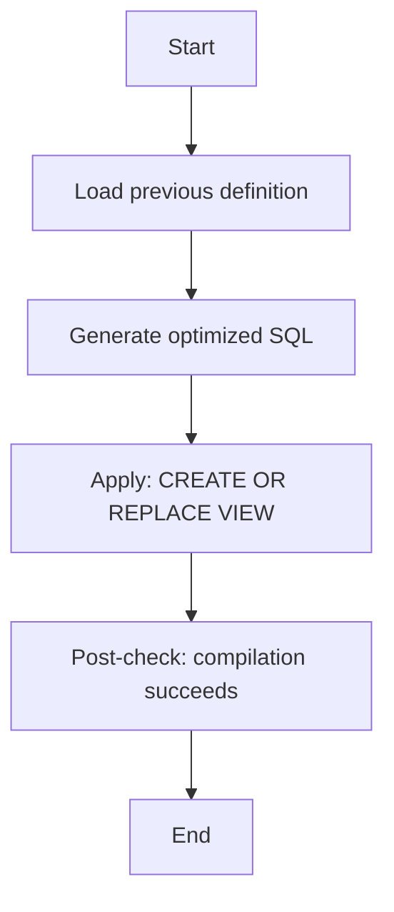

# Procedure Flow — OPT_LAB_CLONE_4.RETAIL.V_NEVER_ORDERED_PRODUCTS

## Flow
This execution applies a view definition update.



## Applied SQL
```sql
CREATE OR REPLACE VIEW OPT_LAB_CLONE_4.RETAIL.V_NEVER_ORDERED_PRODUCTS AS
/*
  Optimized view: V_NEVER_ORDERED_PRODUCTS
  Optimizations / Fixes:
  - Fixed invalid projection (previously `SELECT p.`) to select all product columns via `p.*`.
  - Fully qualified table references (already present) retained for clarity and stability.
  - Used NOT EXISTS correlated subquery to efficiently find products with no order_items.
*/
SELECT
    p.*
FROM OPT_LAB_CLONE_4.RETAIL.products AS p
WHERE NOT EXISTS (
    SELECT 1
    FROM OPT_LAB_CLONE_4.RETAIL.order_items AS oi
    WHERE oi.product_id = p.product_id
);
```

## Execution metadata
- execution_id: `exec-2026-07-12T09:00:00Z`
- warehouse: `ADF_WH`
- mode: `APPLY`
- status: `SUCCESS`
