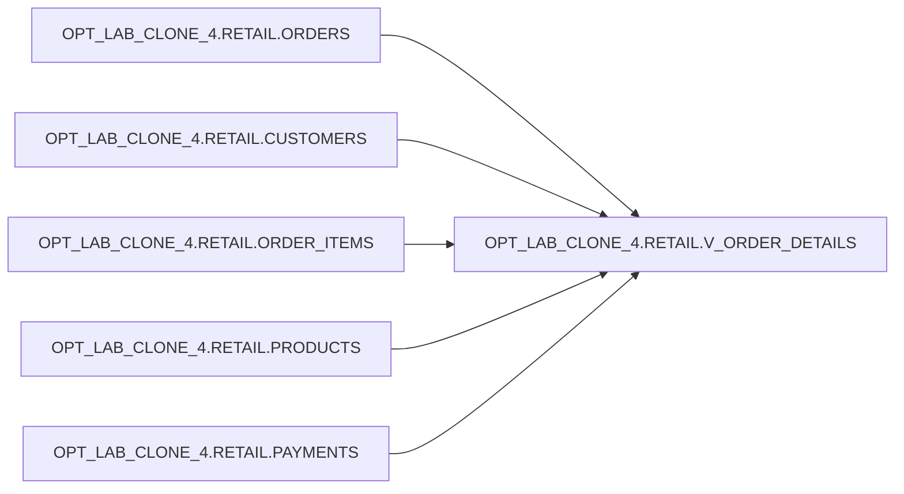

# Lineage (table-level)

```mermaid
graph LR
  ORDERS[OPT_LAB_CLONE_4.RETAIL.ORDERS] --> V[OPT_LAB_CLONE_4.RETAIL.V_ORDER_DETAILS]
  CUSTOMERS[OPT_LAB_CLONE_4.RETAIL.CUSTOMERS] --> V
  ORDER_ITEMS[OPT_LAB_CLONE_4.RETAIL.ORDER_ITEMS] --> V
  PRODUCTS[OPT_LAB_CLONE_4.RETAIL.PRODUCTS] --> V
  PAYMENTS[OPT_LAB_CLONE_4.RETAIL.PAYMENTS] --> V
```

Notes:
- `PAYMENTS` is joined with `LEFT JOIN` (optional relationship).
- APPLY failed; lineage reflects intended definition only.
