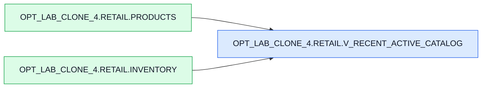

# Lineage — V_RECENT_ACTIVE_CATALOG

## Object-level lineage

```mermaid
flowchart LR
  V[OPT_LAB_CLONE_4.RETAIL.V_RECENT_ACTIVE_CATALOG]:::view
  P[OPT_LAB_CLONE_4.RETAIL.PRODUCTS]:::table
  I[OPT_LAB_CLONE_4.RETAIL.INVENTORY]:::table

  P --> V
  I --> V

  classDef view fill:#dbeafe,stroke:#2563eb,color:#111827;
  classDef table fill:#dcfce7,stroke:#16a34a,color:#111827;
```

## Notes
- The view selects product attributes from `PRODUCTS` and requires a matching row in `INVENTORY` via an inner join.
