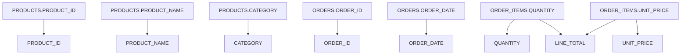

# Column lineage — OPT_LAB_CLONE_5.RETAIL.V_PRODUCT_SALES

**Object**: `OPT_LAB_CLONE_5.RETAIL.V_PRODUCT_SALES`  
**Type**: VIEW  
**Execution**: `exec-2026-07-12T16:15:00Z`

## Column-level mapping

| Output column | Input(s) | Transformation |
|---|---|---|
| `PRODUCT_ID` | `OPT_LAB_CLONE_5.RETAIL.PRODUCTS.PRODUCT_ID` | Identity (`p.PRODUCT_ID`) |
| `PRODUCT_NAME` | `OPT_LAB_CLONE_5.RETAIL.PRODUCTS.PRODUCT_NAME` | Identity (`p.PRODUCT_NAME`) |
| `CATEGORY` | `OPT_LAB_CLONE_5.RETAIL.PRODUCTS.CATEGORY` | Identity (`p.CATEGORY`) |
| `ORDER_ID` | `OPT_LAB_CLONE_5.RETAIL.ORDERS.ORDER_ID` | Identity (`o.ORDER_ID`) |
| `ORDER_DATE` | `OPT_LAB_CLONE_5.RETAIL.ORDERS.ORDER_DATE` | Identity (`o.ORDER_DATE`) |
| `QUANTITY` | `OPT_LAB_CLONE_5.RETAIL.ORDER_ITEMS.QUANTITY` | Identity (`oi.QUANTITY`) |
| `UNIT_PRICE` | `OPT_LAB_CLONE_5.RETAIL.ORDER_ITEMS.UNIT_PRICE` | Identity (`oi.UNIT_PRICE`) |
| `LINE_TOTAL` | `OPT_LAB_CLONE_5.RETAIL.ORDER_ITEMS.QUANTITY`, `OPT_LAB_CLONE_5.RETAIL.ORDER_ITEMS.UNIT_PRICE` | Arithmetic (`oi.QUANTITY * oi.UNIT_PRICE`) |

## Join-only inputs

- `OPT_LAB_CLONE_5.RETAIL.CUSTOMERS.CUSTOMER_ID` joins to `OPT_LAB_CLONE_5.RETAIL.ORDERS.CUSTOMER_ID` (no projected columns).

