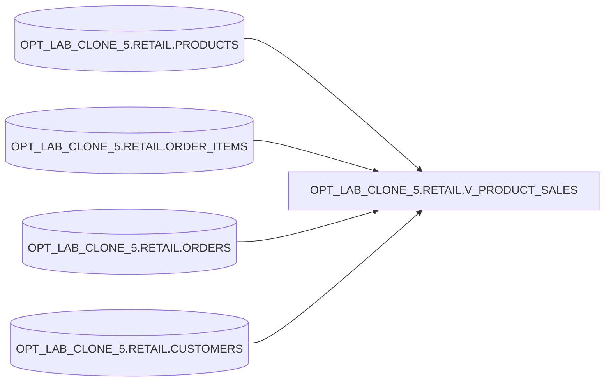

# Lineage — OPT_LAB_CLONE_5.RETAIL.V_PRODUCT_SALES

**Object**: `OPT_LAB_CLONE_5.RETAIL.V_PRODUCT_SALES`  
**Type**: VIEW  
**Execution**: `exec-2026-07-12T16:15:00Z`

## High-level data flow

## Query summary

- Projects product attributes from `PRODUCTS`, order header attributes from `ORDERS`, and line attributes from `ORDER_ITEMS`.
- `CUSTOMERS` participates only as a filtering/join relation (no direct projection).

## Optimization delta

- **Before**: `SELECT DISTINCT ...` across joined tables.
- **After**: `SELECT ...` without `DISTINCT`; same projected columns/order.
