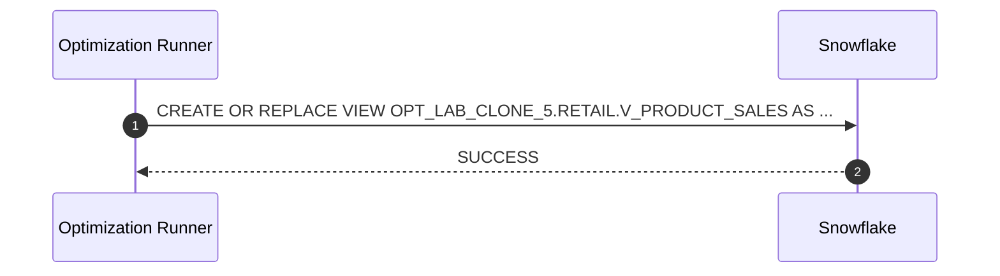

# Procedure flow — OPT_LAB_CLONE_5.RETAIL.V_PRODUCT_SALES

**Object**: `OPT_LAB_CLONE_5.RETAIL.V_PRODUCT_SALES`  
**Type**: VIEW  
**Execution**: `exec-2026-07-12T16:15:00Z`

## Execution flow (APPLY)



## Applied SQL

```sql
CREATE OR REPLACE VIEW OPT_LAB_CLONE_5.RETAIL.V_PRODUCT_SALES AS
-- Optimized VIEW: removed unnecessary DISTINCT and fully qualified base tables
-- to avoid extra global deduplication and improve robustness, while preserving
-- the exact output schema (columns, order, and types).

SELECT
    p.PRODUCT_ID,
    p.PRODUCT_NAME,
    p.CATEGORY,
    o.ORDER_ID,
    o.ORDER_DATE,
    oi.QUANTITY,
    oi.UNIT_PRICE,
    oi.QUANTITY * oi.UNIT_PRICE AS LINE_TOTAL
FROM OPT_LAB_CLONE_5.RETAIL.PRODUCTS     p
JOIN OPT_LAB_CLONE_5.RETAIL.ORDER_ITEMS  oi ON oi.PRODUCT_ID = p.PRODUCT_ID
JOIN OPT_LAB_CLONE_5.RETAIL.ORDERS       o  ON o.ORDER_ID    = oi.ORDER_ID
JOIN OPT_LAB_CLONE_5.RETAIL.CUSTOMERS    c  ON c.CUSTOMER_ID = o.CUSTOMER_ID
```

## Outcome

- Status: `SUCCESS`
- Message: Optimized VIEW applied successfully. OPT_LAB_CLONE_5.RETAIL.V_PRODUCT_SALES now uses fully qualified tables and removes the DISTINCT while preserving the product sales output schema.
