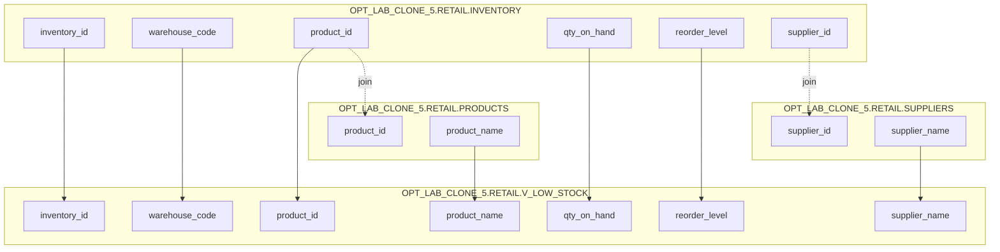

# Column Lineage — OPT_LAB_CLONE_5.RETAIL.V_LOW_STOCK

## Mapping
| Output column | Source expression | Upstream column(s) |
|---|---|---|
| `inventory_id` | `i.inventory_id` | `OPT_LAB_CLONE_5.RETAIL.INVENTORY.inventory_id` |
| `warehouse_code` | `i.warehouse_code` | `OPT_LAB_CLONE_5.RETAIL.INVENTORY.warehouse_code` |
| `product_id` | `i.product_id` | `OPT_LAB_CLONE_5.RETAIL.INVENTORY.product_id` |
| `qty_on_hand` | `i.qty_on_hand` | `OPT_LAB_CLONE_5.RETAIL.INVENTORY.qty_on_hand` |
| `reorder_level` | `i.reorder_level` | `OPT_LAB_CLONE_5.RETAIL.INVENTORY.reorder_level` |
| `product_name` | `p.product_name` | `OPT_LAB_CLONE_5.RETAIL.PRODUCTS.product_name` |
| `supplier_name` | `s.supplier_name` | `OPT_LAB_CLONE_5.RETAIL.SUPPLIERS.supplier_name` |

## Join keys (non-output)
- `p.product_id = i.product_id`
- `s.supplier_id = i.supplier_id`

## Column lineage diagram

