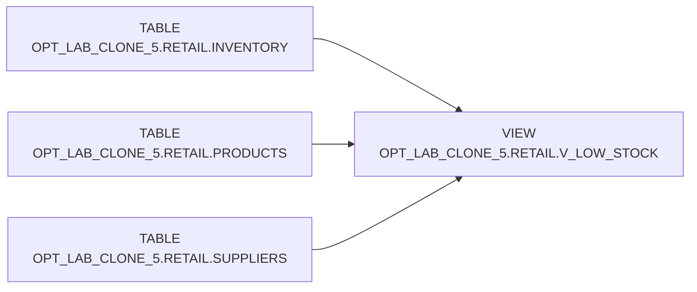

# Lineage — OPT_LAB_CLONE_5.RETAIL.V_LOW_STOCK

## Upstream objects
- `OPT_LAB_CLONE_5.RETAIL.INVENTORY` (base table)
- `OPT_LAB_CLONE_5.RETAIL.PRODUCTS` (lookup)
- `OPT_LAB_CLONE_5.RETAIL.SUPPLIERS` (lookup)

## Lineage diagram

## Notes
- `PRODUCTS` and `SUPPLIERS` are joined with `LEFT JOIN` to enrich inventory rows with names.
- The low-stock condition is applied on `INVENTORY` quantities.
