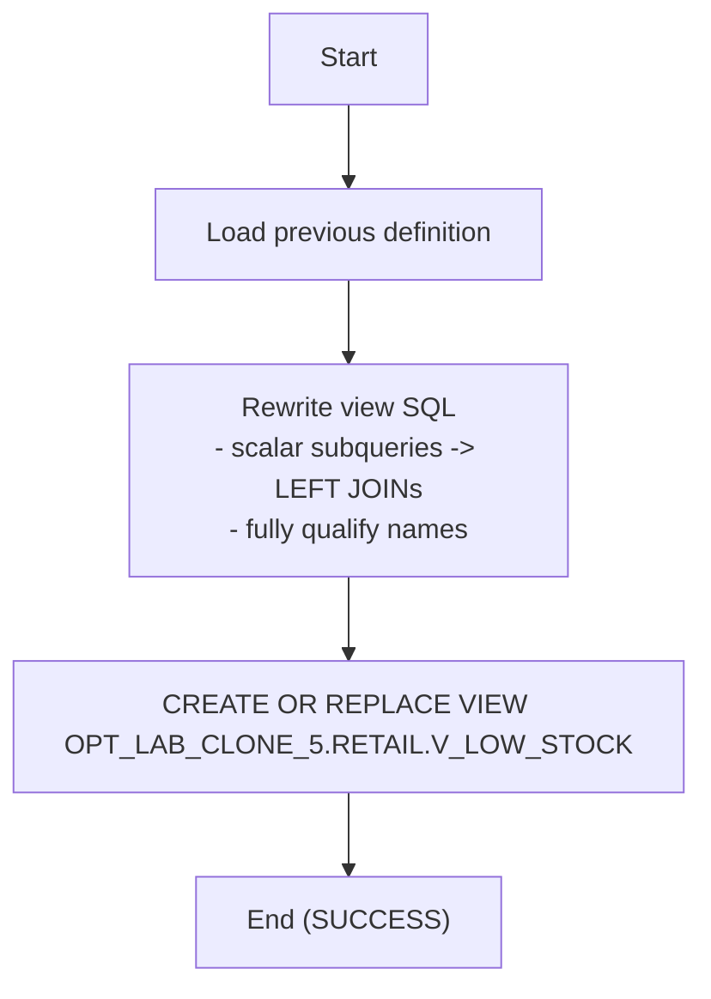

# Procedure Flow — OPT_LAB_CLONE_5.RETAIL.V_LOW_STOCK

## Execution
- **Execution ID**: `exec-2026-07-12T14:45:00Z`
- **Task ID**: `opt-1`
- **Warehouse**: `ADF_WH`
- **Mode**: `APPLY`
- **Result**: `SUCCESS`

## Flow


## Previous definition
```sql
CREATE OR REPLACE VIEW OPT_LAB_CLONE_5.RETAIL.V_LOW_STOCK AS
SELECT
 i.inventory_id,
 i.warehouse_code,
 i.product_id,
 i.qty_on_hand,
 i.reorder_level,
 (SELECT p.product_name FROM products p WHERE p.product_id = i.product_id) AS product_name,
 (SELECT s.supplier_name FROM suppliers s WHERE s.supplier_id = i.supplier_id) AS supplier_name
FROM inventory i
WHERE i.qty_on_hand < i.reorder_level;
```

## Applied definition
```sql
CREATE OR REPLACE VIEW OPT_LAB_CLONE_5.RETAIL.V_LOW_STOCK AS
/*
  Optimized view: low stock inventory

  Optimizations:
  1) Replaced scalar subqueries with explicit JOINs to PRODUCTS and SUPPLIERS
     to avoid per-row subquery execution and enable better join planning.
  2) Fully qualified PRODUCTS, SUPPLIERS, and INVENTORY tables to avoid
     search-path dependence and ensure stable name resolution.
*/
SELECT
    i.inventory_id,
    i.warehouse_code,
    i.product_id,
    i.qty_on_hand,
    i.reorder_level,
    p.product_name,
    s.supplier_name
FROM OPT_LAB_CLONE_5.RETAIL.INVENTORY AS i
LEFT JOIN OPT_LAB_CLONE_5.RETAIL.PRODUCTS AS p
    ON p.product_id = i.product_id
LEFT JOIN OPT_LAB_CLONE_5.RETAIL.SUPPLIERS AS s
    ON s.supplier_id = i.supplier_id
WHERE i.qty_on_hand < i.reorder_level
```
