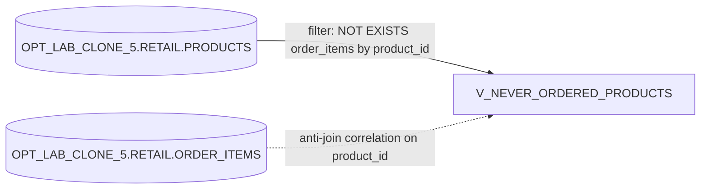

# Lineage: OPT_LAB_CLONE_5.RETAIL.V_NEVER_ORDERED_PRODUCTS

## Object-level lineage

- **Target view:** `OPT_LAB_CLONE_5.RETAIL.V_NEVER_ORDERED_PRODUCTS`
- **Reads from:**
  - `OPT_LAB_CLONE_5.RETAIL.PRODUCTS`
  - `OPT_LAB_CLONE_5.RETAIL.ORDER_ITEMS`

## Relationship summary

The view returns rows from `PRODUCTS` where no matching `ORDER_ITEMS` exist for the same `PRODUCT_ID` (anti-join / NOT EXISTS pattern).

## Execution status

- **Execution:** exec-2026-07-12T10:30:00Z
- **Status:** FAILED
- **Error:** SQL compilation error: error line 15 at position 4 invalid identifier 'P.PRICE'
