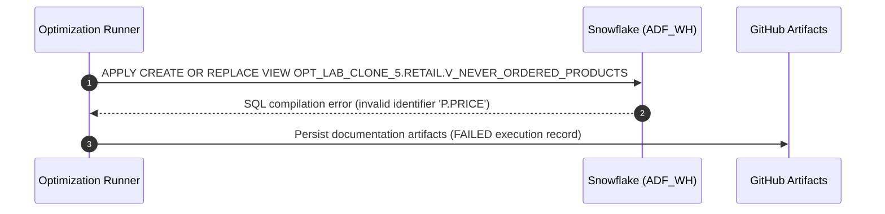

# Procedure Flow: exec-2026-07-12T10:30:00Z

```mermaid
sequenceDiagram
  autonumber
  participant Runner as Optimization Runner
  participant Snowflake as Snowflake (ADF_WH)
  participant Repo as GitHub Artifacts

  Runner->>Snowflake: APPLY CREATE OR REPLACE VIEW OPT_LAB_CLONE_5.RETAIL.V_NEVER_ORDERED_PRODUCTS
  Snowflake-->>Runner: SQL compilation error (invalid identifier 'P.PRICE')
  Runner->>Repo: Persist documentation artifacts (FAILED execution record)
```
