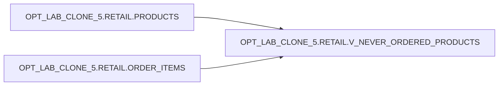

# Lineage — OPT_LAB_CLONE_5.RETAIL.V_NEVER_ORDERED_PRODUCTS

**Execution:** `exec-2026-07-12T12:15:00Z`

## Object-level lineage

- **Target view:** `OPT_LAB_CLONE_5.RETAIL.V_NEVER_ORDERED_PRODUCTS`
- **Reads from:**
  - `OPT_LAB_CLONE_5.RETAIL.PRODUCTS` (alias `p`)
  - `OPT_LAB_CLONE_5.RETAIL.ORDER_ITEMS` (alias `oi`)

## Mermaid (object lineage)

