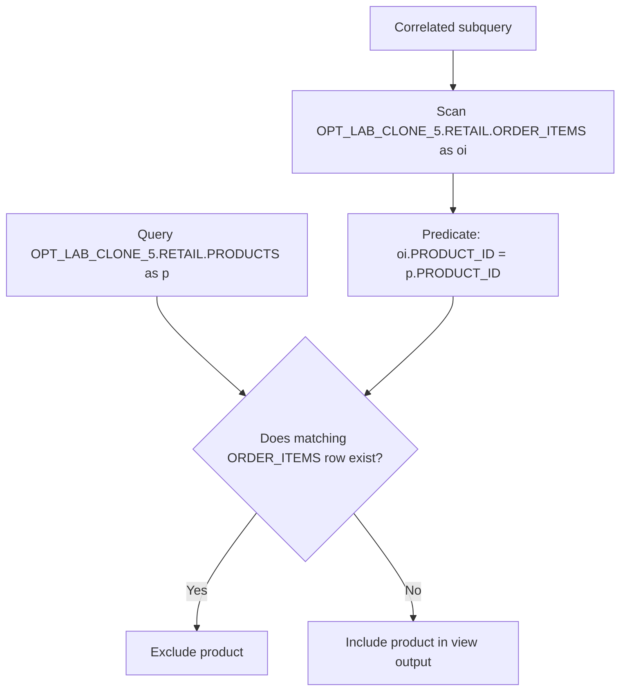

# Procedure Flow — OPT_LAB_CLONE_5.RETAIL.V_NEVER_ORDERED_PRODUCTS

**Execution:** `exec-2026-07-12T12:15:00Z`

## Flow (logical)

## Applied optimization notes

- Replaced `NOT IN (SELECT ...)` with `NOT EXISTS` (NULL-safe anti-join).
- Fully qualified table references.
- Preserved output schema by selecting `p.*`.
