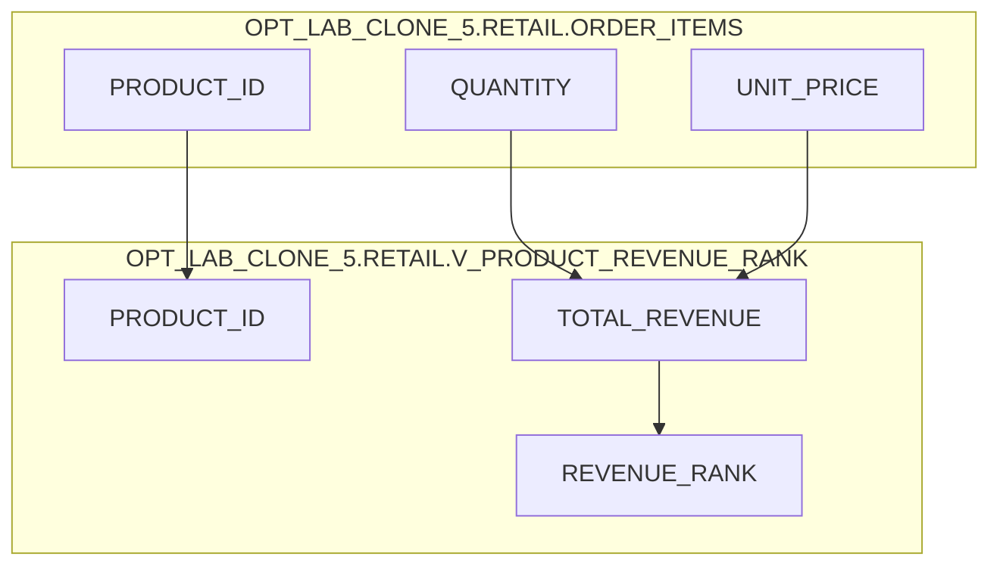

# Column lineage — OPT_LAB_CLONE_5.RETAIL.V_PRODUCT_REVENUE_RANK

## Mapping
| Target column | Source column(s) / expression |
|---|---|
| `PRODUCT_ID` | `OPT_LAB_CLONE_5.RETAIL.ORDER_ITEMS.PRODUCT_ID` |
| `TOTAL_REVENUE` | `SUM(OPT_LAB_CLONE_5.RETAIL.ORDER_ITEMS.QUANTITY * OPT_LAB_CLONE_5.RETAIL.ORDER_ITEMS.UNIT_PRICE)` |
| `REVENUE_RANK` | `RANK() OVER (ORDER BY SUM(OPT_LAB_CLONE_5.RETAIL.ORDER_ITEMS.QUANTITY * OPT_LAB_CLONE_5.RETAIL.ORDER_ITEMS.UNIT_PRICE) DESC)` |

