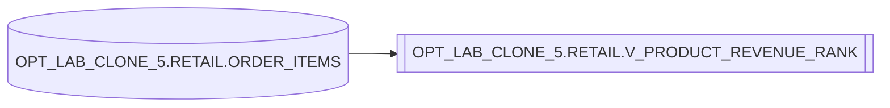

# Lineage — OPT_LAB_CLONE_5.RETAIL.V_PRODUCT_REVENUE_RANK

## Relation-level lineage
- Produces: `OPT_LAB_CLONE_5.RETAIL.V_PRODUCT_REVENUE_RANK`
- Reads from: `OPT_LAB_CLONE_5.RETAIL.ORDER_ITEMS`

## Notes
- Revenue is computed as `SUM(quantity * unit_price)` grouped by `product_id`.
- Rank is computed over the aggregated revenue in descending order.
