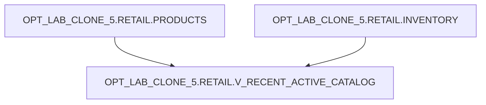

# Lineage: OPT_LAB_CLONE_5.RETAIL.V_RECENT_ACTIVE_CATALOG

## Object-Level Lineage

## Notes

- Join condition: `i.product_id = p.product_id`
- Filters:
  - `p.category COLLATE "en-ci" = 'ELECTRONICS'`
  - `i.last_restocked` constrained to the current year via a half-open range
  - `p.active_flag = TRUE`
