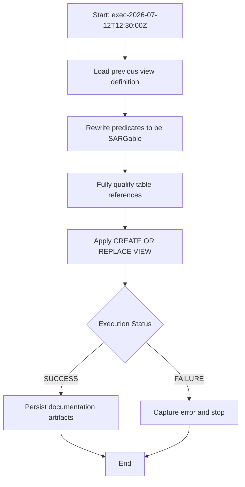

# Procedure Flow: Optimization Apply for OPT_LAB_CLONE_5.RETAIL.V_RECENT_ACTIVE_CATALOG



## Applied SQL

```sql
CREATE OR REPLACE VIEW OPT_LAB_CLONE_5.RETAIL.V_RECENT_ACTIVE_CATALOG AS
/*
  Optimized "recent active catalog" view

  Optimizations:
  1) Fully qualified table names (OPT_LAB_CLONE_5.RETAIL.PRODUCTS and
     OPT_LAB_CLONE_5.RETAIL.INVENTORY) to avoid search-path ambiguity and
     aid the optimizer.
  2) Rewrote UPPER(p.category) = 'ELECTRONICS' as a case-insensitive
     comparison using COLLATE ... CASE_INSENSITIVE, which preserves
     semantics while allowing index/partition pruning on CATEGORY when
     applicable by avoiding a function on the column.
  3) Replaced YEAR(i.last_restocked) = YEAR(CURRENT_DATE) with a
     half-open date-range predicate on LAST_RESTOCKED for the current
     year, avoiding a function on the column and enabling better
     partition pruning and sargable access.
*/
SELECT
    p.product_id,
    p.product_name,
    p.category,
    p.unit_price
FROM OPT_LAB_CLONE_5.RETAIL.PRODUCTS AS p
JOIN OPT_LAB_CLONE_5.RETAIL.INVENTORY AS i
    ON i.product_id = p.product_id
WHERE p.category COLLATE "en-ci" = 'ELECTRONICS'
  AND i.last_restocked >= DATE_FROM_PARTS(YEAR(CURRENT_DATE), 1, 1)
  AND i.last_restocked <  DATE_FROM_PARTS(YEAR(CURRENT_DATE) + 1, 1, 1)
  AND p.active_flag = TRUE
```
