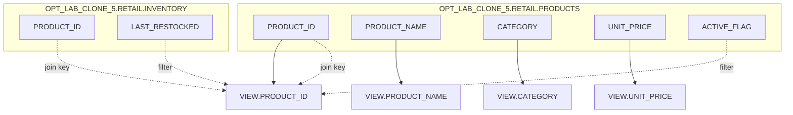

# Column Lineage — OPT_LAB_CLONE_5.RETAIL.V_RECENT_ACTIVE_CATALOG

## Column mappings
| Target column | Source expression | Base column(s) |
|---|---|---|
| `PRODUCT_ID` | `p.product_id` | `OPT_LAB_CLONE_5.RETAIL.PRODUCTS.PRODUCT_ID` |
| `PRODUCT_NAME` | `p.product_name` | `OPT_LAB_CLONE_5.RETAIL.PRODUCTS.PRODUCT_NAME` |
| `CATEGORY` | `p.category` | `OPT_LAB_CLONE_5.RETAIL.PRODUCTS.CATEGORY` |
| `UNIT_PRICE` | `p.unit_price` | `OPT_LAB_CLONE_5.RETAIL.PRODUCTS.UNIT_PRICE` |

## Filter lineage (non-output)
- `p.active_flag = TRUE` uses `OPT_LAB_CLONE_5.RETAIL.PRODUCTS.ACTIVE_FLAG`
- Restock window uses `OPT_LAB_CLONE_5.RETAIL.INVENTORY.LAST_RESTOCKED`
- Category constraint uses `OPT_LAB_CLONE_5.RETAIL.PRODUCTS.CATEGORY`

## Diagram

