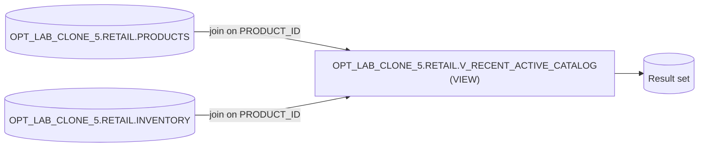

# Lineage — OPT_LAB_CLONE_5.RETAIL.V_RECENT_ACTIVE_CATALOG

## Dataset lineage

## Notes

- This view returns active products in the `ELECTRONICS` category with inventory rows whose `LAST_RESTOCKED` falls within the current calendar year.
