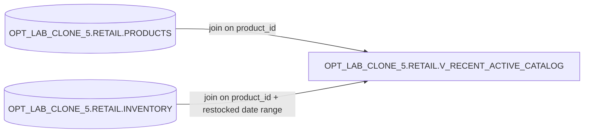

# Lineage — OPT_LAB_CLONE_5.RETAIL.V_RECENT_ACTIVE_CATALOG

## Overview
This view exposes the **active** products in the **ELECTRONICS** category that have inventory restocked **during the current calendar year**.

## Object-level lineage

## Notes on applied optimization
- Removed function-on-column predicate `UPPER(p.category)` in favor of `p.category = 'ELECTRONICS'` (assumes normalized case aligns with prior behavior).
- Replaced `YEAR(i.last_restocked) = YEAR(CURRENT_DATE)` with a sargable range predicate for partition pruning.
- Fully qualified base tables.
