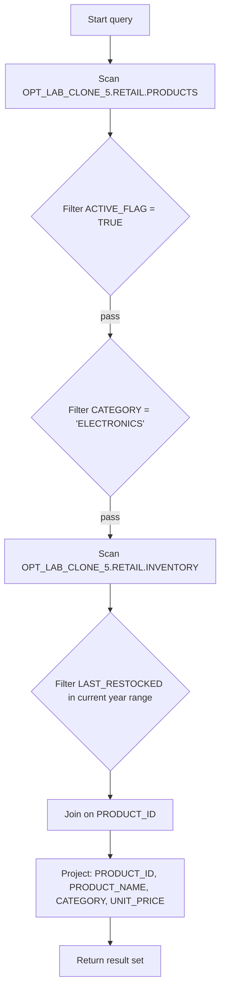

# Procedure Flow — OPT_LAB_CLONE_5.RETAIL.V_RECENT_ACTIVE_CATALOG

```mermaid
flowchart TD
  A[Start query] --> B[Scan OPT_LAB_CLONE_5.RETAIL.PRODUCTS]
  B --> C{Filter ACTIVE_FLAG = TRUE}
  C -->|pass| D{Filter CATEGORY = 'ELECTRONICS'}
  D -->|pass| E[Scan OPT_LAB_CLONE_5.RETAIL.INVENTORY]
  E --> F{Filter LAST_RESTOCKED in current year range}
  F --> G[Join on PRODUCT_ID]
  G --> H[Project: PRODUCT_ID, PRODUCT_NAME, CATEGORY, UNIT_PRICE]
  H --> I[Return result set]
```
