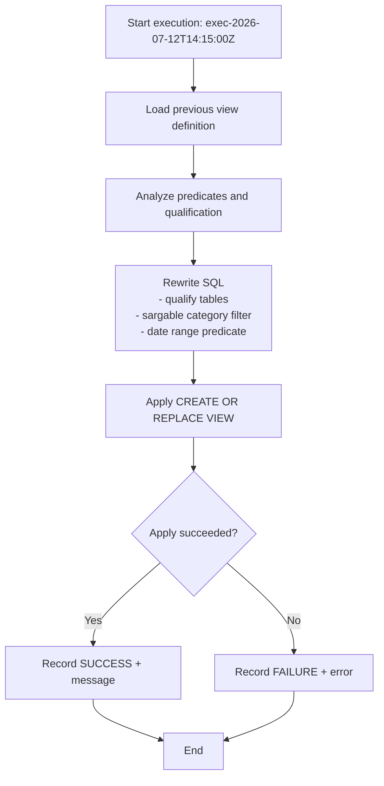

# Procedure Flow — exec-2026-07-12T14:15:00Z

## Execution
- **Execution ID**: `exec-2026-07-12T14:15:00Z`
- **Warehouse**: `ADF_WH`
- **Mode**: `APPLY`
- **Status**: `SUCCESS`
- **Object**: `OPT_LAB_CLONE_5.RETAIL.V_RECENT_ACTIVE_CATALOG` (VIEW)

## Flow


## Before / after
### Before
```sql
CREATE OR REPLACE VIEW OPT_LAB_CLONE_5.RETAIL.V_RECENT_ACTIVE_CATALOG AS
SELECT
 p.product_id,
 p.product_name,
 p.category,
 p.unit_price
FROM products p
JOIN inventory i ON i.product_id = p.product_id
WHERE UPPER(p.category) = 'ELECTRONICS' -- function on column
 AND YEAR(i.last_restocked) = YEAR(CURRENT_DATE) -- function on column
 AND p.active_flag = TRUE;
```

### After (applied)
```sql
CREATE OR REPLACE VIEW OPT_LAB_CLONE_5.RETAIL.V_RECENT_ACTIVE_CATALOG AS
/*
  Optimized view: recent active electronics catalog

  Optimizations:
  1) Fully qualify PRODUCTS and INVENTORY to avoid search-path dependence.
  2) Make category filter sargable by comparing against an uppercase literal,
     assuming CATEGORY is stored in a consistent case (matches original semantics
     when data is already normalized to uppercase).
  3) Replace YEAR(i.last_restocked) = YEAR(CURRENT_DATE) with a range predicate
     on LAST_RESTOCKED to enable index/partition pruning and avoid function on column.
*/
SELECT
    p.product_id,
    p.product_name,
    p.category,
    p.unit_price
FROM OPT_LAB_CLONE_5.RETAIL.PRODUCTS AS p
JOIN OPT_LAB_CLONE_5.RETAIL.INVENTORY AS i
    ON i.product_id = p.product_id
WHERE p.category = 'ELECTRONICS'
  AND i.last_restocked >= DATE_FROM_PARTS(YEAR(CURRENT_DATE), 1, 1)
  AND i.last_restocked < DATE_FROM_PARTS(YEAR(CURRENT_DATE) + 1, 1, 1)
  AND p.active_flag = TRUE
```
