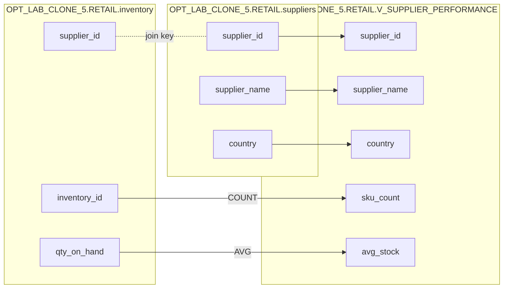

# Column lineage — OPT_LAB_CLONE_5.RETAIL.V_SUPPLIER_PERFORMANCE

## Mapping

| View column | Expression | Upstream column(s) |
|---|---|---|
| `supplier_id` | `s.supplier_id` | `OPT_LAB_CLONE_5.RETAIL.suppliers.supplier_id` |
| `supplier_name` | `s.supplier_name` | `OPT_LAB_CLONE_5.RETAIL.suppliers.supplier_name` |
| `country` | `s.country` | `OPT_LAB_CLONE_5.RETAIL.suppliers.country` |
| `sku_count` | `COUNT(i.inventory_id)` | `OPT_LAB_CLONE_5.RETAIL.inventory.inventory_id` |
| `avg_stock` | `AVG(i.qty_on_hand)` | `OPT_LAB_CLONE_5.RETAIL.inventory.qty_on_hand` |

## Diagram

